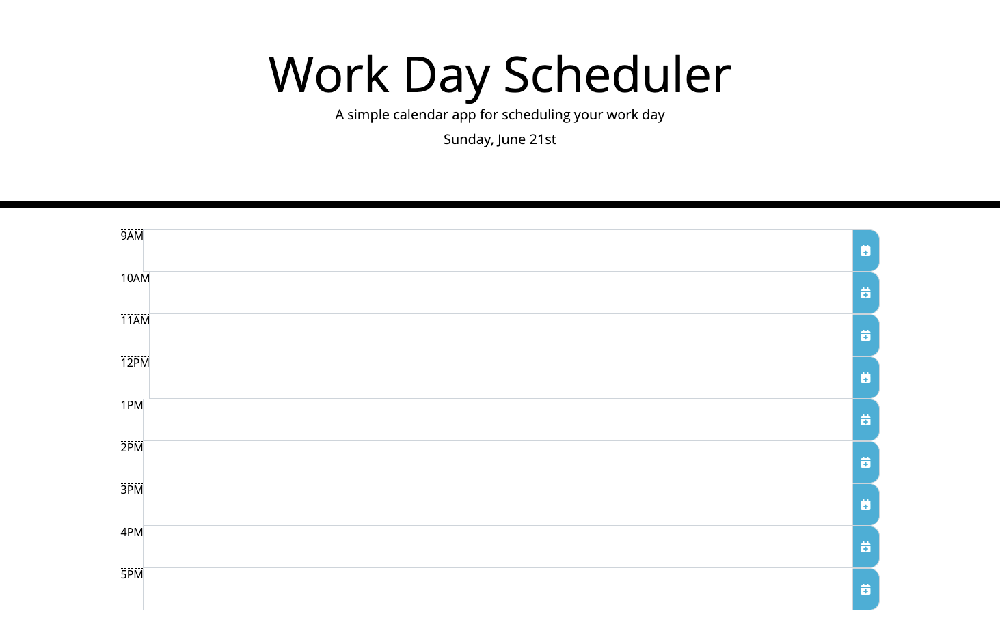

Workday Scheduler App

This app acts as a way to store and track tasks throughout the workday. The daily planner displays the current day of the week and provides timeblocks for tasks. Each timeblock is color coded based on the time of day and whether is past (grey), present (red), or future (green). 

Technology | Libraries: 
+Bootstrap 
+JQuery
+Moment.js

Deployment:
[https://sidoniag.github.io/workday_scheduler/].

